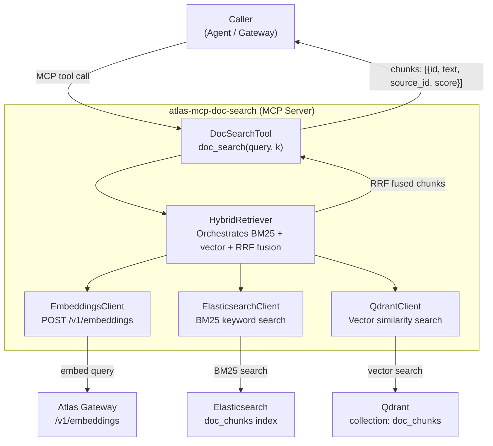

# Component Diagram — atlas-mcp-doc-search (C4 Level 3)

Internal components of the `atlas-mcp-doc-search` MCP server and their dependencies.

```mermaid
flowchart TD
    Caller["Caller\n(Agent / Gateway)"]

    subgraph MCP_Server["atlas-mcp-doc-search (MCP Server)"]
        DocSearchTool["DocSearchTool\ndoc_search(query, k)"]
        HybridRetriever["HybridRetriever\nOrchestrates BM25 + vector + RRF fusion"]
        EmbeddingsClient["EmbeddingsClient\nPOST /v1/embeddings"]
        ElasticsearchClient["ElasticsearchClient\nBM25 keyword search"]
        QdrantClient["QdrantClient\nVector similarity search"]
    end

    Gateway["Atlas Gateway\n/v1/embeddings"]
    Elasticsearch["Elasticsearch\ndoc_chunks index"]
    Qdrant["Qdrant\ncollection: doc_chunks"]

    Caller -->|"MCP tool call"| DocSearchTool
    DocSearchTool --> HybridRetriever
    HybridRetriever --> EmbeddingsClient
    HybridRetriever --> ElasticsearchClient
    HybridRetriever --> QdrantClient
    EmbeddingsClient -->|"embed query"| Gateway
    ElasticsearchClient -->|"BM25 search"| Elasticsearch
    QdrantClient -->|"vector search"| Qdrant
    HybridRetriever -->|"RRF fused chunks"| DocSearchTool
    DocSearchTool -->|"chunks: [{id, text, source_id, score}]"| Caller
```
