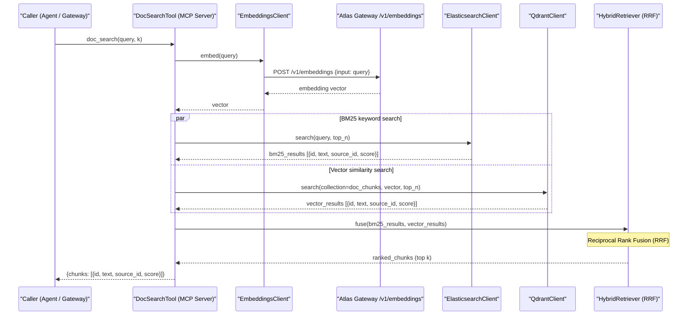

# Sequence Diagram — Hybrid doc_search Flow

End-to-end flow for a single `doc_search` call, showing parallel retrieval and RRF fusion.

```mermaid
sequenceDiagram
    participant Caller as "Caller (Agent / Gateway)"
    participant Server as "DocSearchTool (MCP Server)"
    participant Embedder as "EmbeddingsClient"
    participant Gateway as "Atlas Gateway /v1/embeddings"
    participant ES as "ElasticsearchClient"
    participant Qdrant as "QdrantClient"
    participant Fuser as "HybridRetriever (RRF)"

    Caller->>Server: doc_search(query, k)
    Server->>Embedder: embed(query)
    Embedder->>Gateway: POST /v1/embeddings {input: query}
    Gateway-->>Embedder: embedding vector
    Embedder-->>Server: vector

    par BM25 keyword search
        Server->>ES: search(query, top_n)
        ES-->>Server: bm25_results [{id, text, source_id, score}]
    and Vector similarity search
        Server->>Qdrant: search(collection=doc_chunks, vector, top_n)
        Qdrant-->>Server: vector_results [{id, text, source_id, score}]
    end

    Server->>Fuser: fuse(bm25_results, vector_results)
    Note over Fuser: Reciprocal Rank Fusion (RRF)
    Fuser-->>Server: ranked_chunks (top k)

    Server-->>Caller: {chunks: [{id, text, source_id, score}]}
```
